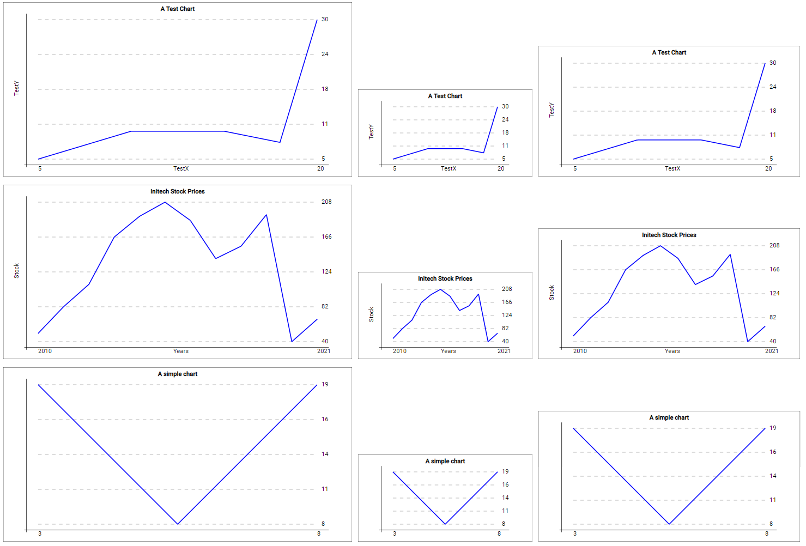

= Reusable Chart

In this exercise we'll cover two aspects of Angular:

. How smartly implemented components can be reused across your application
** By passing a different configuration / different data to them
. How to bind Angular properties to the attributes of non-Angular HTML elements

The goal is to implement a line chart component.
It will take an array of data points (at least two, but no explicit upper limit) and some configuration values like axes labels and title.
Not only can we feed different data to the component, we can also alter the size by supplying different `width` and `height` values.

The finished application could -- based on the rudimentary `app.component` you've been provided with -- like this:

This illustrates:

* The same component
* Used 9 times
* With 3 different data sets
* With 3 different (pixel) sizes

== Requirements

* Ensure that it is sufficient to supply the chart component the data points, a title and _optional_ axes labels together with width and height -- nothing more
** The data is constrained to an (x,y) pair
* Based on the given height and width the component has to automatically *scale* the chart so that all data points fit into the canvas
** Also support different aspect ratios (like extra-wide charts)
** As a simplification you are _allowed_ to assume some values as fixed (e.g. font size, border pixels,...)
*** This will make it necessary to enforce a few _minimal_ requirements like at least two data points, at least width a and height b...
* Show the title and -- if supplied -- the axis labels
* Show the minimum and maximum value on the x-axis
* Show _five_ equally spaced values on the y-axis
** Including 'helper' lines for better visualization
* Do not only test with the given data sets and definitions, try some other combinations
** Maybe even _negative_ values? 😮

=== How to create a chart?

There are of course many good libraries for creating charts like https://www.chartjs.org/[ChartJS].
But, this time we are going to *do it all by ourselves!*

A HTML5 element that is very well suited not only for the task at hand but also when used together with Angular is https://en.wikipedia.org/wiki/Scalable_Vector_Graphics[SVG] (if you are unsure what the difference to e.g. a PNG is, just read the article 😉).
SVG is defined as XML within HTML.
So it consists of elements like `<line ... />`.
Such elements can be directly addressed and controlled by Angular!
Not only is it possible to use something like `*ngFor` or `*ngIf` but we can also bind to the attributes of the elements.

TIP: If you want to bind to e.g. the attribute `x` of a non-Angular HTML element you can use a property binding for `[attr.x]`.

The biggest challenge here is to calculate the pixel position of each element based on the width and height of the SVG and the values of the data points.
All of that, of course, in such a way, that the component can be reused for a variety of data and sizes.

TIP: You might want to invert the y-axis

=== Looks

The requirements for this assignment have already been specified, but you can earn bonus credit íf you manage to create informative, good-looking, well-scaling, correct and generally awesome charts (= better than in the example 😏).
